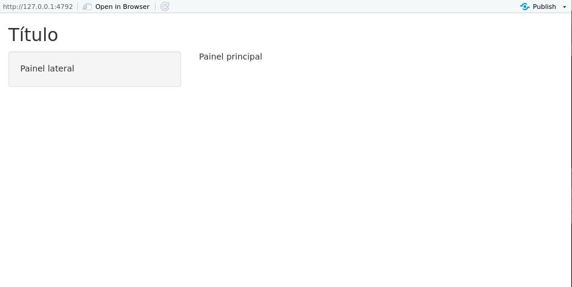

## User side

Tudo o que será apresentado ao usuário está guardado no objeto `ui`, que nada mais é do que um código HTML. Experimente rodar uma função do *user side* no console. O que você receberá será sempre um código HTML.

```{r}
fluidPage()
```

A função `fluidPage()` utilizada como exemplo acima é utilizada pelo Shiny para criar um display que automaticamente ajusta as dimensões da janela do navegador do usuário. Os elementos da interface do usuário são então colocados dentro dessa função. Veja um exemplo:

```{r, eval=FALSE}
ui <- fluidPage(
  titlePanel("Título"),

  sidebarLayout(
    sidebarPanel("Painel lateral"),
    mainPanel("Painel principal")
  )
)
```

O objeto `ui` acima gerará a seguinte interface:

```{r, echo=FALSE}

```

As funções `titlePanel()` e `sidebarLayout()` são os argumentos da função `fluidPage()`. A primeira gera o título "Título", enquanto a segunda estrutura um layout com barra lateral para o app.

A função `sidebarLayout()` recebe dois argumentos: 

- `sidebarPanel()` - estrutura o painel na barra lateral; e
- `mainPanel()` - estrutura o painel principal.

Essa é uma das estruturas mais simples e populares para a interface de usuário de um Shiny app.

Note que nós criamos apenas títulos e painéis. Não há nada com o que o usuário possa interagir. Para isso, precisamos adicionar os *inputs*.

### inputs

Na prática, inputs são widgets que possibilitam a interação do usuário com o app. Eles recebem um valor escolhido pelo usuário e o envia para o *server side*. Segue uma lista dos principais inputs utilizados num Shiny app:

`actionButton()` - botão para executar uma ação.
`checkboxGroupInput()` - 	um grupo de *check boxes*.
`checkboxInput()` -	um único *check box*.
`dateInput()` -	um calendário para seleção de data.
`dateRangeInput()` -	um par de calendários para escolher um intervalo de datas.
`fileInput()` -	uma ferramenta para auxiliar o upload de arquivos.
`numericInput()` -	Um campo para enviar números.
`radioButtons()` -	Um conjunto de botões para seleção.
`selectInput()` -	Um *select box* com um conjunto de opções.
`sliderInput()` -	Um slider.
`textInput()` -	Um campo para enviar texto.

No nosso primeiro exemplo, no item anterior, nós utilizamos um `sliderInput()` para interagir com o número de classes do histograma.

```{r, eval=FALSE}
ui <- fluidPage(

    titlePanel("Meu primeiro shiny app!"),

  sidebarLayout(
    sidebarPanel(
      sliderInput(inputId = "classes",
                  label = "Número de classes:",
                  min = 1,
                  max = 30,
                  value = 10)
    ),

    mainPanel(
      plotOutput(outputId = "hist")
    )
  )
)
```

Repare que a função `sliderInput()` recebe alguns argumentos. O mais importante é o `inputId=`. Esse argumento definirá o nome que usaremos para chamar esse input dentro do server. O argumento `label=` recebe o texto que aparecerá no widget, ajudando o usuário a entender o que o input controla. 

Cada input terá argumentos específicos da própria função. Assim, se você nunca usou um determinado input, procure no `help()` da função quais são os argumentos que ela recebe. No caso da `sliderInput()`, podemos controlar o valor mínimo do slider (`min = 1`), o valor máximo (`max = 30`) e o valor padrão (`value = 10`).

Agora que já sabemos como enviar objetos para o *server side*, vamos ver como receber as suas saídas.

### outputs

No exemplo do histograma, o input do nosso app era o número de classes e o output era o próprio histograma. Veja que no objeto `ui` temos o seguinte código:

```{r, eval=FALSE}
mainPanel(
      plotOutput(outputId = "distPlot")
    )
```

Isso quer dizer que vamos receber um output do tipo "plot" (gráfico) do servidor e colocá-lo dentro do `mainPanel()`. 

Da mesma forma que há uma função para cada tipo de input, há uma função para cada tipo de output:

`dataTableOutput()` -	para data frames.
`htmlOutput()` ou `uiOutput()` - para código HTML.
`imageOutput()` - para imagens.
`plotOutput()` - para gráficos.
`tableOutput()` - para tabelas.
`textOutput()` - para textos.
`verbatimTextOutput()` - para textos não-formatados.

Assim como as funções de input, funções de output recebem um argumento de identificação, o `outputId=`. Esse argumento recebe uma string que representa o nome utilizado no *server side* para se referir a esse output. Consulte o `help()` de cada função para saber mais sobre os argumentos adicionais.

Criados os inputs e outputs do app, agora precisamos manipulá-los no *server side*. Vamos ver como fazer isso.
