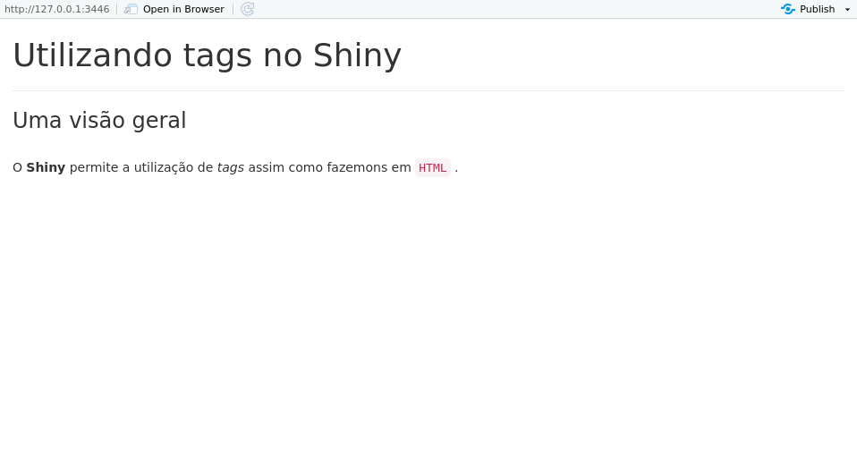
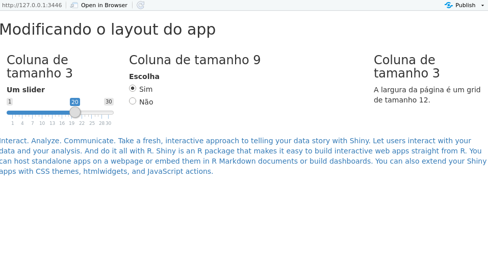

## Costumizando aparência

Como já vimos na introdução desta seção, o objeto `ui` nada mais é do que um código em HTML estruturado pela função `fluidPage()`.

Quem conhece um pouco de HTML sabe que adicionamos conteúdo estático a uma página web a partir de tags. 

```
<div class = "container-fluid">
  <h1> Título </h1>
  <p style = "font-family: import">
    Veja exemplos de aplicativos na
    <a href = "https://shiny.rstudio.com/gallery/"> Shiny Gallery </a>
  </p>
</div>
```
Não se preocupe em entender o código acima. Ele é apenas um exemplo de como as tags funcionam no HTML. Veja, por exemplo, que a tag `<h1>` é utilizada para criar um título, a tag `<p>` cria parágrafos e a tag `<a>` cria hiperlinks. A tag `<div>` cria seções dentro da página com um mesmo estilo ou formato.

No Shiny, também podemos trabalhar com tags utilizando a função `tags()`. Essa função, na verdade, é uma lista de funções que mimetizam as tags do HTML. Veja as principais:

`tags$h1()` - Cria um título.
`tags$a()` - Cria um hiperlink.
`tags$p()` - Cria um parágrafo.
`tags$em()` - Formata o texto em itálico.
`tags$code()` - Formata o texto em código. 
`tags$strong()` - Formata o texto em negrito.
`tags$br()` - Pula uma linha.
`tags$hr()` - Cria uma linha horizontal.
`tags$img()` - Adiciona uma imagem (é preciso salvá-la em um subdiretório chamado `www`).

```{r, eval=FALSE}
library(shiny)

ui <- fluidPage(
  tags$h1("Utilizando tags no Shiny"),
  tags$hr(),
  h3("Uma visão geral"),
  br(),
  tags$p("O", strong("Shiny"), "permite a utilização de", tags$em("tags"),
         "assim como fazemons em", tags$code("HTML"), ".")
)

server <- function(input, output) {

}

shinyApp(ui, server)
```

```{r}

```


Algumas dessas funções vêm com um `wrapper` do tipo `nome-da-tag()`. Por exemplo, as funções `tags$h1()` e `h1()` são equivalentes.

Se você for bom em programação web, é possível escrever o objeto `ui` diretamente em HTML. Para passar código em HTML diretamente para a função `fluidPage()`, utilize a função `HTML()`.

Uma outra forma de customizar a aparência do seu app é alterar o layout da página. 

A página de um Shiny app tem sempre três dimensões: altura, largura e profundidade. Utilizando a função `fluidPage()`, a altura e a profundidade são variáveis, isto é, você pode controlá-las à vontade, mas a largura é fixa, formando um grid de 12 unidades. Essa unidades são adimensionais, o que significa que o app sempre vai se redimensionar para se ajustar a qualquer tela, sem criar uma barra de rolagem horizontal.

Para alterar o layout da página, você precisa usar as funções de layout:

- `fluidRow()` - Orienta a posição dos objetos dentro de uma mesma linha.
- `column()` - Orienta a posição dos objetos dentro de uma mesma coluna.
- `fixedPage()` - Usada no lugar da `fluidPage()`. Ela limita o seu comprimento em 940px em uma tela padrão e 724px ou 1170px em telas menores ou maiores respectivamente.
- `fixedRow()` - Usada no lugar de `fluidRow()` dentro da função `fixedPage()`.
- `navbarPage()` - Cria um layout de navegação por abas. Cada aba representa um nível de profundidade do aplicativo.
- `dashboardPage()` - Função do pacote `shinydashboad`. Usada para criar dashboards com o Shiny.

```{r, eval=FALSE}
library(shiny)

ui <- fluidPage(
  fluidRow(
    titlePanel("Modificando o layout do app"),
    column(3,
           h3("Coluna de tamanho 3"),
           sliderInput(inputId = "slider",
                       label = "Um slider",
                       min = 1,
                       max = 30,
                       value = 20)),
    column(6,
           h3("Coluna de tamanho 9"),
           radioButtons(inputId = "botao",
                        label = "Escolha",
                        choices = c("Sim", "Não"))),
    column(3,
           h3("Coluna de tamanho 3"),
           tags$p("A largura da página é um grid de tamanho 12."))
  ),
  fluidRow(
    tags$a("Interact. Analyze.
           Communicate. Take a fresh,
           interactive approach to telling
           your data story with Shiny. Let users interact with
           your data and your analysis. And do it all with R.
           Shiny is an R package that makes it easy to build
           interactive web apps straight from R.
           You can host standalone apps on a webpage or embed
           them in R Markdown documents or build dashboards.
           You can also extend your Shiny apps with CSS themes,
           htmlwidgets, and JavaScript actions.",
           href = "https://shiny.rstudio.com/")
  )
)

server <- function(input, output) {

}

shinyApp(ui, server)

```

```{r}

```

A profundide em um Shiny app é acessada utilizando abas e painéis. As principais funções para trabalhar com essa feature são: `wellPanel()`, `tabPanel()`,  `tabsetPanel()` e `navlistPanel()`.

Deixamos como exercício entender a utilização de cada uma dessas funções. Lembre-se sempre de olhar o `help()` e visitar o [tutorial completo do Shiny](https://shiny.rstudio.com/tutorial/) no site do Rstudio.

Também é possível trabalhar com CSS dentro do Shiny. Por padrão, o Shiny usa o framework [Bootstrap³](getbootstrap.com). Se você quiser usar um arquivo `.css` próprio, você precisa colocá-lo em um subdiretório chamado `www` e especificar o nome do arquivo no argumento `theme=` das funções `fluidPage()` ou `fixedPage()`.

Há outras duas formas de alterar o CSS. A primeira é utilizar a função `tags$style()` para alterar o CSS global. A segunda é modificar o argumento `style=` dentro das funções `tags$_()`. Assista a última parte [desse vídeo tutorial](https://shiny.rstudio.com/tutorial/) para mais informações.
   
