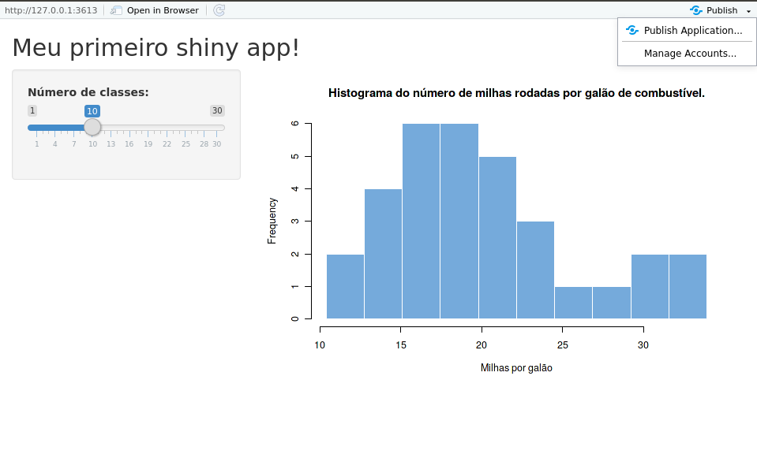

## Compartilhando

Para compartilhar o seu app online, o Shiny oferece duas opções: o Shiny Server e o shinyapps.io. Veja a seguir mais detalhes sobre cada uma dessas opções.

**Nota**: independente da opção escolhida, para o compartilhamento online funcionar, o script com o código precisa ter o nome `app.R`.

### Shiny Server

O Shiny Server é um programa *backend* gratuito que monta um servidor web em linux feito para hospedar aplicativos em Shiny.

Para download, instruções de uso e mais informações, acesse o site: https://www.rstudio.com/products/shiny/shiny-server/.

O Shiny Server também tem uma versão paga, o [Shiny Server Pro](https://www.rstudio.com/products/shiny-server-pro/), que disponibiliza ferramentas de segurança, performance, gerencialmente e suporte.

### shinyapps.io

O shinyapps.io é um sistema do RStudio (que envolve tanto um pacote do R como uma página web) para a hospedagem de aplicativos em Shiny. As vantagens de se usar esse serviço são as seguintes:

- Você não vai precisar contratar um serviço de hospedagem nem configurar um servidor Linux.

- Ele é escalável, isto é, quando muita gente começa a usar o seu app, o servidor vai alocar mais processamento automaticamente para não perder performance.

- É seguro, fácil de usar e tem um versão gratuita.

Para começar a usar o shinyapps.io, você precisa:

**1.** Instalar o pacote `rsconnect`.

```{r, eval=FALSE}
devtools::install_github("rstudio/rsconnect")
```

**2.** Criar uma conta no [shinyapps.io](shinyapps.io).

**3.** No RStudio, rodar o app e clicar em *Publish*.

```{r, echo = FALSE}

```

Basta seguir as instruções e em alguns minutos você receberá um link para acessar o seu app online. Assim, tudo o que uma pessoa precisará para acessá-lo é um navegador web.

Para mais informações, acesse o [guia do usuário do shinyapps.io](http://docs.rstudio.com/shinyapps.io/).


