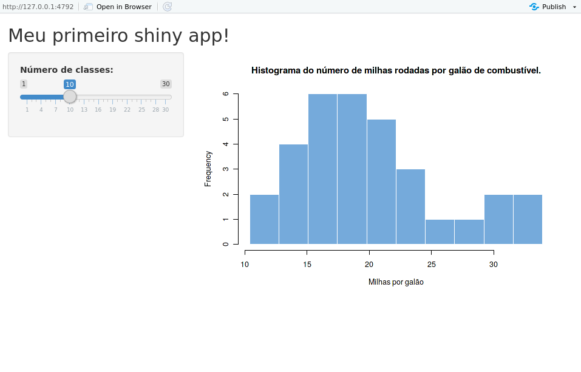
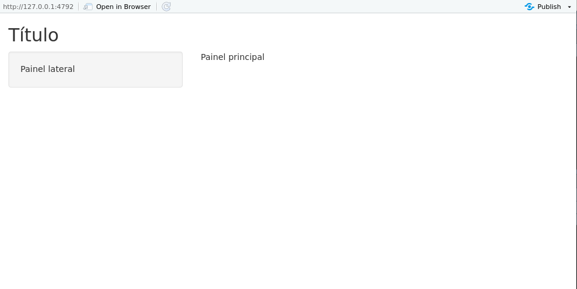

## Introdução

Até gora, pincelamos os principais elementos de transformação, visualização e modelagem de dados. Para completar nossa análise, precisamos de boas ferramentas de comunicação.

A maior parte dos trabalhos de análise estatística possui três *outputs* possíveis: 

- relatórios analíticos;
- *dashboards* de visualização; e
- APIs (*Application Programming Interfaces*).

O objetivo desta seção é a construção de *dashboards* utilizando o pacote `shiny`.

O Shiny é um sistema para desenvolvimento de aplicações web usando o R, um pacote do R (`shiny`) e um servidor web (`shiny server`). O Shiny é exatamente isso e nada mais, portanto Shiny **não** é uma página web, **não** é um substituto para sistemas mais gerais, como Ruby on Rails e Django, e também **não** é uma ferramenta gerencial, como o Tableau.

Para entender sobre Shiny, é necessário entender primeiro o que é [server side e user side](http://programmers.stackexchange.com/a/171210 "diferencas"). Quando surfamos na web, nos _comunicamos_ com servidores do mundo inteiro, geralmente por meio do protocolo HTTP.

No *server side*, processamos requisições e dados do cliente, estruturamos e enviamos páginas web, interagimos com banco de dados etc. Linguagens *server side* comuns são PHP, C#, Java, R etc (virtualmente qualquer linguagem de programação).

No *user side*, criamos interfaces gráficas a partir dos códigos recebidos pelo servidor. É onde enviamos e recebemos as informações do *server side*. As "linguagens" mais usuais nesse caso são HTML, CSS e JavaScript.

Mas onde está o Shiny nisso tudo? O código de uma aplicação Shiny nos permite estruturar tanto a interface com o usuário quanto o processamento de dados, geração de visualizações e modelagem, isto é, nós programamos tanto o *user side* quanto o *server side* numa tacada só. Assim, ao rodarmos o código, criamos um servidor que envia páginas web, recebe informações do usuário e processa os dados, utilizando apenas o R.

O pacote `shiny` do R possui internamente um servidor web básico, geralmente utilizado para aplicações locais, permitindo somente uma aplicação por vez. O `shiny server` é um programa que roda somente em Linux que permite o acesso a múltiplas aplicações simultaneamente. Falaremos mais sobre isso no item *Compartilhando*.

Antes de começarmos a explorar o Shiny, instale o pacote `shiny` no seu computador


```r
install.packages("shiny")
```

e, em seguida, carregue o pacote


```r
library(shiny)
## Error in library(shiny): there is no package called 'shiny'
```

## Estrutura básica

Um aplicativo em Shiny (ou Shiny app) é gerado por um único script chamado `app.R`. Esse script tem três componentes:

- um objeto com a interface do usuário (*user side*);

- uma função `server()` (*server side*); e

- uma chamada para a função `shinyApp()`.

Apresentamos abaixo um exemplo minimal de aplicação com essa estrutura.


```r
library(shiny)

# Define a interface do usuário para o app que gera um histograma.
ui <- fluidPage(

  # Título do app.
  titlePanel("Meu primeiro shiny app!"),

  # Barra lateral com as definições do input e do output.
  sidebarLayout(

    # Barra lateral para os inputs.
    sidebarPanel(

      # Input: número de classes do histograma.
      sliderInput(inputId = "classes",
                  label = "Número de classes:",
                  min = 1,
                  max = 30,
                  value = 10)

    ),

    # Painel principal para mostrar os outputs.
    mainPanel(

      # Output: Histograma
      plotOutput(outputId = "distPlot")

    )
  )
)


# Define o código necessário para a construção de um histograma.
server <- function(input, output) {

  # Função que gera o histograma e devolve para o user side.
  # Essa função é reativa. Isso significa que o histograma
  # vai mudar sempre que o valor do número de classes mudar.
  output$distPlot <- renderPlot({

    x    <- mtcars$mpg
    bins <- seq(min(x), max(x), length.out = input$classes + 1)

    hist(x, breaks = bins, col = "#75AADB", border = "white",
         xlab = "Milhas por galão",
         main = "Histograma do número de milhas rodadas por galão de combustível.")

  })

}

shinyApp(ui = ui, server = server)
```

Não se assuste com tanto vocabulário novo! Vamos passar por cada função ao decorrer desta seção. Nesse primeiro momento, queremos apenas que você se familiarize com a estrutura do código: primeiro a definição do objeto `ui`, em seguida a estruturação da função `server()` e por fim a chamada da função `shinyApp()`.

Existem duas maneiras de rodar o aplicativo. A primeira é rodar a função `runApp("caminho-para-o-arquivo-app.R")`. A segunda é clicar no botão "Run App" que vai aparecer no RStudio logo acima do seu script. Sempre que você estruturar um arquivo da maneira acima, o RStudio vai entender que se trata de um Shiny app e vai gerar essa opção (e outras).

Ao rodar o app, uma nova janela se abrirá e você terá acesso ao aplicativo (veja figura baixo). Ele estará rodando localmente, então você ainda não poderá acessá-lo pela internet.


```r

```


Minimize a janela e veja no seu console que a sessão do R estará ocupada rodando o aplicativo. Assim, um Shiny app terá sempre uma sessão de R rodando por trás.

Você pode interagir com o app mudando o número de classes no *slider* gerado à esquerda. Sempre que você mudar o valor, o gráfico será atualizado automaticamente.

Para encerrar o aplicativo, basta fechar a janela. Observe no console que a sessão volta a ficar disponível.

Agora que você já conhece melhor a estrutura de um Shiny app, vamos entender melhor como construí-lo, começando com a interface do usuário.


## User side

Tudo o que será apresentado ao usuário está guardado no objeto `ui`, que nada mais é do que um código HTML. Experimente rodar uma função do *user side* no console. O que você receberá será sempre um código HTML.


```r
fluidPage()
## Error in fluidPage(): could not find function "fluidPage"
```

A função `fluidPage()` utilizada como exemplo acima é utilizada pelo Shiny para criar um display que automaticamente ajusta as dimensões da janela do navegador do usuário. Os elementos da interface do usuário são então colocados dentro dessa função. Veja um exemplo:


```r
ui <- fluidPage(
  titlePanel("Título"),

  sidebarLayout(
    sidebarPanel("Painel lateral"),
    mainPanel("Painel principal")
  )
)
```

O objeto `ui` acima gerará a seguinte interface:



As funções `titlePanel()` e `sidebarLayout()` são os argumentos da função `fluidPage()`. A primeira gera o título "Título", enquanto a segunda estrutura um layout com barra lateral para o app.

A função `sidebarLayout()` recebe dois argumentos: 

- `sidebarPanel()` - estrutura o painel na barra lateral; e
- `mainPanel()` - estrutura o painel principal.

Essa é uma das estruturas mais simples e populares para a interface de usuário de um Shiny app.

Note que nós criamos apenas títulos e painéis. Não há nada com o que o usuário possa interagir. Para isso, precisamos adicionar os *inputs*.

### inputs

Na prática, inputs são widgets que possibilitam a interação do usuário com o app. Eles recebem um valor escolhido pelo usuário e o envia para o *server side*. Segue uma lista dos principais inputs utilizados num Shiny app:

`actionButton()` - botão para executar uma ação.
`checkboxGroupInput()` - 	um grupo de *check boxes*.
`checkboxInput()` -	um único *check box*.
`dateInput()` -	um calendário para seleção de data.
`dateRangeInput()` -	um par de calendários para escolher um intervalo de datas.
`fileInput()` -	uma ferramenta para auxiliar o upload de arquivos.
`numericInput()` -	Um campo para enviar números.
`radioButtons()` -	Um conjunto de botões para seleção.
`selectInput()` -	Um *select box* com um conjunto de opções.
`sliderInput()` -	Um slider.
`textInput()` -	Um campo para enviar texto.

No nosso primeiro exemplo, no item anterior, nós utilizamos um `sliderInput()` para interagir com o número de classes do histograma.


```r
ui <- fluidPage(

    titlePanel("Meu primeiro shiny app!"),

  sidebarLayout(
    sidebarPanel(
      sliderInput(inputId = "classes",
                  label = "Número de classes:",
                  min = 1,
                  max = 30,
                  value = 10)
    ),

    mainPanel(
      plotOutput(outputId = "distPlot")
    )
  )
)
```

Repare que a função `sliderInput()` recebe alguns argumentos. O mais importante é o `inputId=`. Esse argumento definirá o nome que usaremos para chamar esse input dentro do server. O argumento `label=` recebe o texto que aparecerá no widget, ajudando o usuário a entender o que o input controla. 

Cada input terá argumentos específicos da própria função. Assim, se você nunca usou um determinado input, procure no `help()` da função quais são os argumentos que ela recebe. No caso da `sliderInput()`, podemos controlar o valor mínimo do slider (`min = 1`), o valor máximo (`max = 30`) e o valor padrão (`value = 10`).

Agora que já sabemos como enviar objetos para o *server side*, vamos ver como receber as suas saídas.

### outputs

No exemplo do histograma, o input do nosso app era o número de classes e o output era o próprio histograma. Veja que no objeto `ui` temos o seguinte código:


```r
mainPanel(
      plotOutput(outputId = "distPlot")
    )
```

Isso quer dizer que vamos receber um output do tipo "plot" (gráfico) do servidor e colocá-lo dentro do `mainPanel()`. 

Da mesma forma que há uma função para cada tipo de input, há uma função para cada tipo de output:

`dataTableOutput()` -	para data frames.
`htmlOutput()` ou `uiOutput()` - para código HTML.
`imageOutput()` - para imagens.
`plotOutput()` - para gráficos.
`tableOutput()` - para tabelas.
`textOutput()` - para textos.
`verbatimTextOutput()` - para textos não-formatados.

Assim como as funções de input, funções de output recebem um argumento de identificação, o `outputId=`. Esse argumento recebe uma string que representa o nome utilizado no *server side* para se referir a esse output. Consulte o `help()` de cada função para saber mais sobre os argumentos adicionais.

Criados os inputs e outputs do app, agora precisamos manipulá-los no *server side*. Vamos ver como fazer isso.


## Server side

- Arquitetura
   - atualização dos parâmetros (inputs)
   - outputs
   - funções Render
   - dar exemplos


## Reatividade

- Exemplo Excel
- reactive values
- reactive functions
   - render_()
   - reactive()
   - isolate()
   - observeEvent()
   - observe()
   - eventReactive()
   - reactiveValues()


## Costumizando aparência

- fluidPage()
- tags()
   - exemplos
- HTML()
- layout
   - fluidRow()
   - fixedPage()
   - fixedRow()
- Paineis
- shinydashboard
- CSS


## Compartilhando

- app.R (precisa ter esse nome)
- shinyapps.io
   - servidor do Rstudio
   - escalável
   - fácil
   - gratuito*
   - explicar como publicar
- Servidor próprio
   - Shiny server

### Shiny Server Pro

- Licença comercial do Shiny-server
- Possui algumas características a mais, como autenticação e suporte.

### shinyapps.io

- Para compartilhar um aplicativo shiny, geralmente precisamos ter um servidor Linux (geralmente utilizando algum serviço na cloud como AWS ou DigitalOcean) com o shiny server instalado.
- Isso pode ser doloroso.
- O shinyapps.io é um sistema (que envolve tanto pacote do R como uma página web) que permite que o usuário coloque sua aplicação shiny na web sem muito esforço.
- O serviço foi desenvolvido pela RStudio Inc. e possui contas grátis e pagas.

